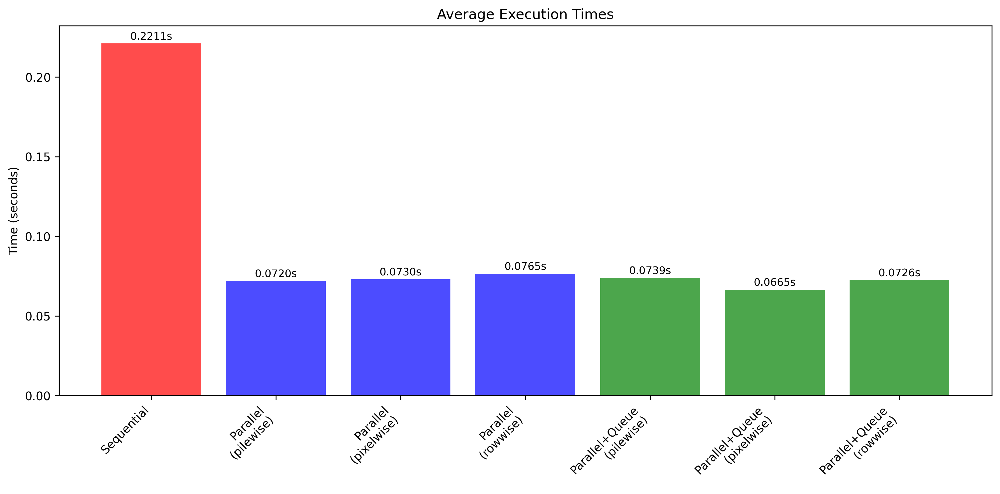
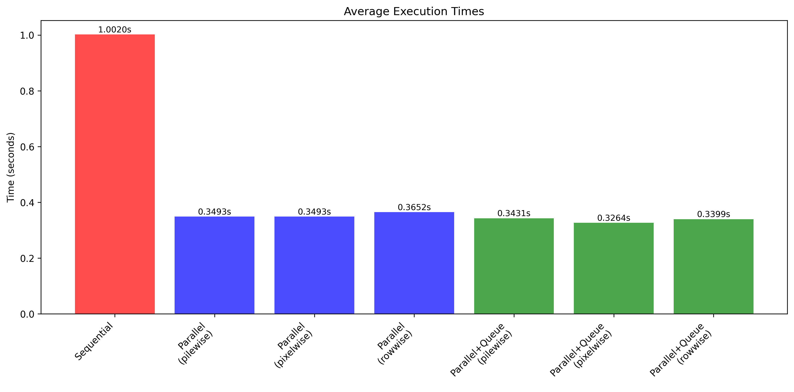
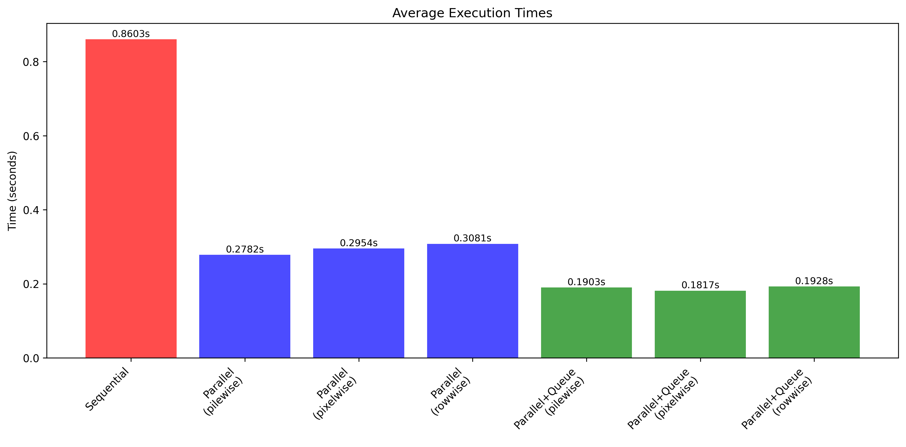
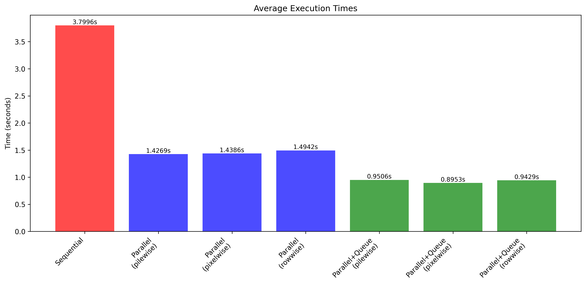

# Benchmarks
## System

OS: Linux Fedora 6.16

CPU: Intel(R) Core(TM) i7-10750H CPU @ 2.60GHz

RAM: 8 GB

## Test data

Test data can be found in `images/input`.

### "Small" images:

Mona_Lisa.bmp 960x1431 pixels

Almond_van_Gogh.bmp 1367x1080 pixels

Sunflowers_van_Gogh.bmp 960x1211 pixels

Impression_Sunrise.bmp 1392x1080 pixels

### "Big" images:

The_Ninth_Wave.bmp 3215x2160 pixels

## Testing

### Functions to test

First of all, there are three functions to test:
1. First one is applying a filter to an image sequentually.
2. Second one uses dedicated thread to read the image, then **n** worker threads apply the filter concurrently, then dedicated thread to write the image.
3. Third one uses different kinds of threads and queues to process an array of images concurrently.

### Ways to divide work between worker threads

3 ways to divide work between worker threads were chosen:
* Rowwise: Divides the image by rows.
* Pixelwise: Divides the work on a per-pixel basis.
* Pilewise: Divides the image into distinct blocks, or piles.

### Metric

In case of single image convolution, these tests measure average total time required to complete a full cycle: reading the image from memory, applying the filter, and writing the result back to memory.

In case of multiple images, these tests measure average total processing throughput, which is the time between reading the first image from memory and writing the last image to the memory.

## Single image

In this test, workers number n=4.

### Small:

### Big: 

The sequential algorithm is significantly slower than all parallel implementations. However, since only a single image is being processed, the performance differences between the various parallel approaches are negligible.

## Multiple images

For this test, 4 images were chosen to be processed in a sequence. For function that uses queues, all of readers, writers and foremen (workers' orchestrators) were set to be 4, to begin proccessing tasks as soon as possible.

Workers number is still n=4.

### Small:

### Big:

As the number of images quadrupled, the processing time for the sequential algorithm also increased nearly fourfold.

The standard parallel implementation experienced a greater-than-fourfold increase in time, likely due to computational stalls between processing stages. Despite this inefficiency, it remained significantly faster than the sequential approach.

In contrast, the parallel implementation with queues saw its processing time only triple. This method provided a 1.5 to 2 times speedup over the standard parallel approach when processing the set of four images.

## Conclusion

Parallel processing accelerated BMP image convolution by more than a factor of three. These gains can be increased further by employing specialized threads and queues. For instance, when processing a sequence of four images, this technique yielded a 1.5-2x speedup over standard parallel methods. Performance is expected to improve even more with a greater number of images.