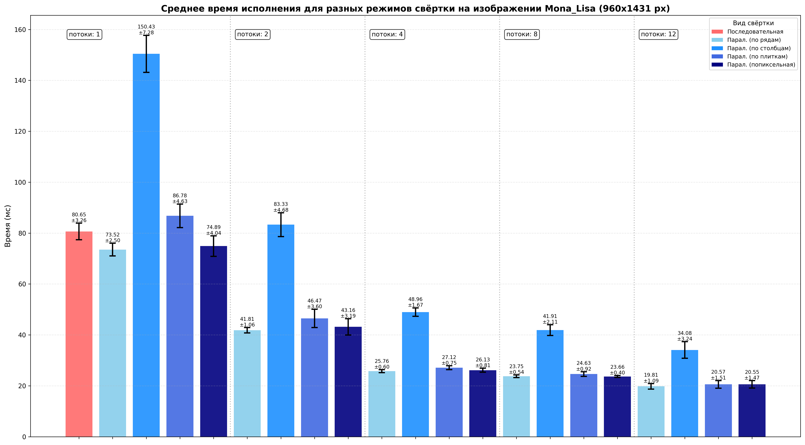
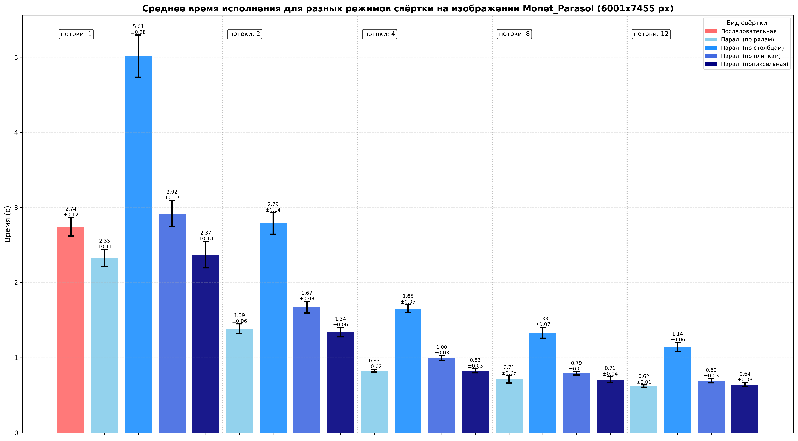
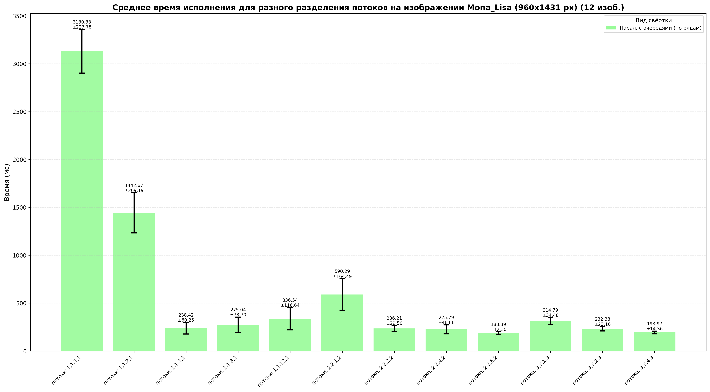
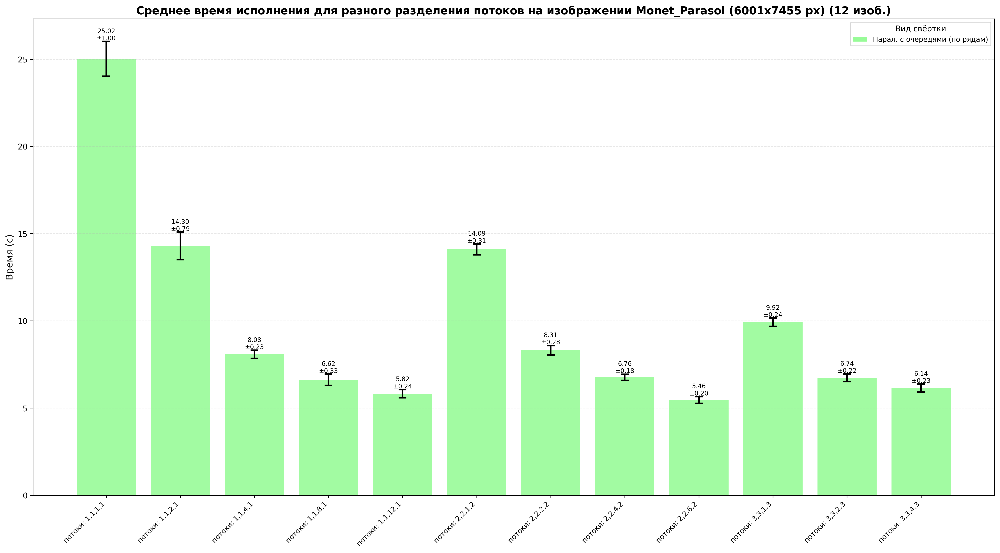

# Бенчмарки

## Система

* OS: Linux Fedora 6.16

* CPU: Intel(R) Core(TM) i7-10750H CPU @ 2.60GHz

* 12 ядер

* RAM: 8 GB

## Набор

Список изображений, использовавшихся в замерах:

- Mona_Lisa.bmp 960x1431 пикселей

- Monet_Parasol.bmp 6001x7455 пикселей 

Все изображения можно найти в images/input. Monet_Parasol хранится в формате .jpg, т.к. .bmp слишком большая для GitHub.

## Функции свёртки

Реализованы три функции для свёртки изображений:

* В первой функции для чтения, применения фильтра к изображению и записи его в память используется **1** поток.
* Во второй чтение и запись совершает **1** поток, применение фильтра происходит с помощью **n** потоков. Число потоков настраивается пользователем.
* В третьей используются разные виды потоков и соответствующих им очередей для конкурентного чтения, применения фильтра и записи потока изображений. Всего существует 4 вида потоков, число каждого вида потоков настраивается пользователем.

### Краткое описание работы потоков

* Reader - поток, читающий изображение из памяти в RAM. После чтения очередного изображения, кладет его в очередь и приступает к следующему изображению, если возможно.
* Foreman - поток, оркестрирующий worker'ами. Число foremen - фактически число изображений, к которым одновременно применяются фильтры. После того, как обработка изображения окончена, кладет его в очередь и приступает к следующему изображению, если возможно.
* Worker - поток, занимающийся применением фильтра к изображению.
* Writer - поток, записывающий изображение из RAM в память. После записи приступает к следующему изображению, если возможно.

### Способы разделения работы между worker-потоками

Было выделено 4 способа разделения работы между потоками:

* По рядам: изображение делится между потоками по рядам.
* По строкам: изображение делится между потоками по строкам.
* Попиксельно: изображение делится между потоками по пикселям.
* По плиткам: изображение делится между потоками по непересекающимся прямоугольникам, или плиткам.

## Вопросы

**RQ1**: Приносит ли увеличение числа потоков в параллельной версии прирост по производительности?

**RQ2**: Какой способ разделения изображения по потокам в параллельной версии алгоритма приносит наибольший прирост по производительности?

**RQ3**: Какая конфигурация потоков в параллельной версии алгоритма с очередями приносит наибольший прирост по производительности?

## Ход работы

Во всех экспериментах количество запусков каждого сценария равно 40. Свёртка проводилась на фильтре blur 3x3.

### Последовательная и параллельная свёртки

Для параллельной свёртки были выделены следующие числа потоков, на которых будет проводиться замер: 1, 2, 4, 8, 12.

Ниже представлены результаты для изображений Mona_Lisa и Monet_Parasol.

**Результат для Mona_Lisa:**

**Результат для Monet_Parasol:**

Из результатов выше можно сделать следующие выводы:

**Ответ на RQ1**: Увеличение числа потоков приносит увеличение в производительности, независимо от способа разделения работы по потокам.

**Ответ на RQ2**: Наибольший прирост по производительности приносят разделение изображения по рядам и по пикселям, для 4 и более потоков также почти незаметно отставание от них разделения по плиткам. Установлено ускорение в 4 раза по сравнению с последовательной версией в случае выбора 12 потоков и любого способа разделения, кроме разделения по столбцам. Разделение по столбцам приводит к производительности около в 2 раз меньшей, чем разделение по рядам, при любом числе потоков.

Близость плиточного и попиксельного разделений с разделением по рядам по производительности связана с тем, что все они обходят во внешнем цикле ряды, а во внутреннем - столбцы. Действительно, при смене двух циклов местами эти реализации стали показывать меньшую производительность.

### Параллельная свёртка потока изображений с очередями

Учитывая то, что на машине максимально доступно 12 ядер, а количество созданных потоков (для описания потоков см. раздел [**Краткое описание работы потоков**](#краткое-описание-работы-потоков)) высчитывается по формуле:

**re + fo + fo * wo + wr**, где:

* re - число reader-потоков;
* fo - число foremen-потоков;
* wo - число worker-потоков;
* wr - число writer-потоков;

то для максимального задействования ядер без больших накладных ресурсов имеет смысл подбирать такие конфигурации, общее число потоков в которых близко к максимальному числу ядер, т.е. 12.
Тем не менее, интересно также посмотреть на эффективность конфигураций, в которых одновременно используется меньше потоков, чем доступно на машине.
В связи с этим были выбраны следующие конфигурации потоков (представлены в соответствии с последовательностью выше, перечислены через '-'):

1,1,1,1 - 1,1,2,1 - 1,1,4,1 - 1,1,8,1 - 1,1,12,1 - 2,2,1,2 - 2,2,2,2 - 2,2,4,2 - 2,2,6,2 - 3,3,1,3 - 3,3,2,3 - 3,3,4,3.

Количество изображений было выбрано равным 12.

Результаты представлены ниже.

**Результаты для Mona_Lisa:**

**Результаты для Monet_Parasol:**

Из результатов выше можно сделать следующий вывод:

**Ответ на RQ3**: Наибольшую производительность показала конфигурация 2 readers, 2 foremen, 6 workers и 2 writers. Эта конфигурация позволяет использовать максимальное число потоков - 12 - для применения фильтра к изображению.
В случае больших изображений, эта конфигурация позволила получить почти пятикратный прирост по производительности по сравнению с конфигурацией 1,1,1,1. Следующими после нее по производительности являются конфигурации 1,1,12,1 и 3,3,4,3, что, скорее всего, связано с тем, что обе эти конфигурации также используют максимальное число потоков для свёртки.
Для небольших изображений разница между конфигурациями оказалась не такой значительной, и все конфигурации кроме 1,1,1,1, 1,1,1,2 и 2,2,1,2 в среднем отработали менее, чем за 350 мс. Конфигурации 2,2,6,2 и 3,3,4,3 отработали в среднем менее, чем за 200 мс, позволяя получить ускорение в 16 раз по сравнению с конфигурацией 1,1,1,1.